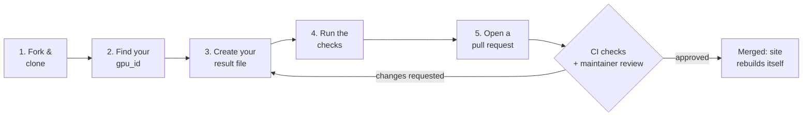

# Contributing to Open GPU Benchmarks

Thanks for helping build an open, reviewable GPU comparison. Every number on the
dashboard comes from a small YAML file in this repository, so **adding a
benchmark result is just adding one file in a pull request.**

## What do you want to do?

| I want to...                              | Go to                                                  |
| ----------------------------------------- | ------------------------------------------------------ |
| **Add my FPS results** (most people)      | [Submit a result in 5 steps](#submit-a-result-in-5-steps) |
| Add a card, laptop, or handheld that isn't in the catalog | [Adding a card, laptop, or handheld](#adding-a-card-laptop-or-handheld) |
| Fix or remove a result I submitted        | [Fixing or removing a result](#fixing-or-removing-a-result) |
| Understand a failed check on my PR        | [Reading a failed check](#reading-a-failed-check)      |
| Change the dashboard, scripts, or docs    | [Other contributions](#other-contributions)            |

## Submit a result in 5 steps



You need Git, Python 3.10+, and a GitHub account. No other tooling.

### Step 1: Fork and clone

Fork the repository on GitHub, clone your fork, and create a branch:

```powershell
git clone https://github.com/<your-github-username>/open-gpu-benchmarks.git
cd open-gpu-benchmarks
git checkout -b add-rtx-4070-super-cyberpunk
python -m pip install pyyaml numpy
```

### Step 2: Find your `gpu_id`

Every product in the catalog has one file under [data/gpus/](data/gpus/README.md).
**The file name, without `.yaml`, is your `gpu_id`.**

```text
data/gpus/
└── desktop/
    └── nvidia/
        └── rtx_4070_super_12gb_fe.yaml     <- gpu_id: rtx_4070_super_12gb_fe
```

The ID names the exact product you tested, including its memory size and, for
desktop cards, its board maker. An 8 GB and a 16 GB card, or an MSI and an ASUS
version of the same GPU, have different IDs, and their results are never mixed.

Current IDs:

| Form factor | IDs |
| ----------- | --- |
| desktop  | `rtx_4090_24gb_fe`, `rtx_4080_super_16gb_fe`, `rtx_4070_super_12gb_fe`, `rx_7900_xtx_24gb_reference`, `arc_a770_16gb_le` |
| laptop   | `rtx_4090_laptop_16gb_generic`, `rtx_4070_laptop_8gb_generic`, `arc_a770m_16gb_generic` |
| handheld | `rog_ally_z1_extreme_16gb`, `legion_go_z1_extreme_16gb`, `steam_deck_oled_16gb` |

Your product isn't listed? Add it first. See
[Adding a card, laptop, or handheld](#adding-a-card-laptop-or-handheld). You
can add the catalog entry and your result in the same pull request.

### Step 3: Create your result file

Create **one file per game run** in your product's folder:

```text
data/
└── community/
    └── rtx_4070_super_12gb_fe/                      <- folder name = gpu_id
        ├── result_20261003_cyberpunk_mattystacks.yaml   <- your file
        └── raw/
            └── cyberpunk_1440p.csv                  <- optional capture (recommended)
```

The file name has four parts:

```text
result_20261003_cyberpunk_2_mattystacks.yaml
       └──┬───┘ └───┬────┘ ┬ └────┬─────┘
       date run   game   repeat  your GitHub username
       (YYYYMMDD) (no     (only   (lowercase is fine;
                  spaces) if you  must match
                          already submitted_by)
                          have a
                          file for
                          that day
                          and game)
```

Pick **one** way to create the file:

**Option A: copy the template (works for any capture method)**

```powershell
Copy-Item templates/community_submission.yaml `
  data/community/rtx_4070_super_12gb_fe/result_20261003_cyberpunk_yourname.yaml
```

Then edit the values. The examples below show what to fill in.

**Option B: generate it from a PresentMon or MangoHud CSV**

```powershell
python scripts/parse.py capture.csv `
  --gpu-id rtx_4070_super_12gb_fe `
  --game "Cyberpunk 2077" `
  --submitted-by yourname `
  --resolution 1440p `
  --graphics-preset Ultra
```

This writes the correctly named file for you. It refuses an ID that isn't in
the catalog and takes the form factor from the catalog entry. It does not know
your hardware, so open the file afterwards and add the `system:` details (CPU,
memory, driver, OS) and any extra resolution/preset profiles by hand. Copy your
CSV into the product's `raw/` folder and point `proof.raw_log` at it, for
example `raw/cyberpunk_1440p.csv`.

### Step 4: Run the checks

```powershell
python scripts/validate.py
python scripts/build.py
python scripts/test_build.py
```

`validate.py` lists **every** problem at once. Each line starts with `error:`
(blocks your PR) or `warning:` (worth improving), then the file, then the rule
name in brackets, then a link to the rule's explanation:

```text
error: data/community/rtx_4070_super_12gb_fe/result_20261003_cyberpunk_yourname.yaml: [result-impossible] result[0] p1_low 80 > avg_fps 60 is impossible
    See https://github.com/MattyStacks/open-gpu-benchmarks/blob/main/docs/COMMUNITY_SUBMISSIONS.md#result-impossible
```

Fix every error. You can check one part at a time with
`python scripts/validate.py catalog` or `python scripts/validate.py results`.

### Step 5: Open a pull request

```powershell
git add data/community/rtx_4070_super_12gb_fe
git commit -m "Add RTX 4070 Super FE Cyberpunk 2077 results"
git push -u origin add-rtx-4070-super-cyberpunk
```

Open the pull request on GitHub and include:

- [ ] Product, game, and game version
- [ ] Resolution and graphics preset(s) you ran
- [ ] Anything unusual (overclock, undervolt, power limit, mods)
- [ ] How you captured the numbers (PresentMon, MangoHud, in-game benchmark)

GitHub runs the same checks you just ran, as three separate checks (see
[Reading a failed check](#reading-a-failed-check)). A maintainer then reviews
the evidence. After merge, the site rebuilds automatically. You do not need to
touch `site/api/`, which is generated.

## Examples

### Minimal file (only what's required)

This is the smallest file that passes validation. It warns about the missing
driver and proof, so prefer the fuller examples below.

```yaml
gpu_id: rtx_4070_super_12gb_fe   # must equal the folder name
submitted_by: mattystacks        # your GitHub username
game: Cyberpunk 2077
frame_generation: false          # must be false for comparable runs
result:
  - resolution: 1440p
    graphics_preset: Ultra
    avg_fps: 98.4
    p1_low: 77.1                 # 1% low; can't be higher than avg_fps
```

### Desktop with raw capture (recommended)

One run, two profiles. Each profile starts with its own `-`.

```yaml
gpu_id: rtx_4070_super_12gb_fe
submitted_by: mattystacks
benchmark_type: game
game: Cyberpunk 2077
version: "2.12"
frame_generation: false
device_name: Ryzen 7 7800X3D test bench
overclocked: false
result:
  - resolution: 1440p            # first profile
    graphics_preset: Ultra RT
    upscaling: DLSS Quality
    avg_fps: 79.1
    p1_low: 65.0
    p5_low: 68.2                 # optional, from PresentMon
  - resolution: 1080p            # second profile: new dash, same indent
    graphics_preset: Ultra RT
    upscaling: DLSS Quality
    avg_fps: 103.4
    p1_low: 84.7
system:
  cpu: AMD Ryzen 7 7800X3D
  memory: 32 GB DDR5
  power_mode: Performance
  display_mode: direct
  driver: "561.09"
  os: Windows 11
proof:
  raw_log: raw/Cyberpunk_4070S_1440p.csv   # relative to this product's folder
  format: presentmon_summary
```

### Laptop (power matters)

Laptop results are grouped by GPU power, so always include `gpu_power_w`.
Validation only warns if it's missing, but your result can't be compared
properly without it. If your laptop model has its own catalog entry, use that
ID. The `_generic` IDs are placeholders for laptops whose model isn't in the
catalog yet. Laptop system RAM goes in `system.memory`, not in the ID, because
it can usually be upgraded.

```yaml
gpu_id: rtx_4070_laptop_8gb_generic
submitted_by: mattystacks
game: Baldur's Gate 3
version: "4.1.1"
frame_generation: false
device_name: Lenovo Legion Pro 5
gpu_power_w: 115                 # the TGP your laptop actually runs at
overclocked: false
result:
  - resolution: 1080p
    graphics_preset: Ultra
    avg_fps: 88.0
    p1_low: 61.5
system:
  cpu: Intel Core i7-13700HX
  memory: 16 GB DDR5
  power_mode: Performance
  display_mode: dGPU only        # MUX switch state
  driver: "560.94"
  os: Windows 11
proof:
  raw_log: raw/bg3_1080p.csv
  format: presentmon_summary
```

### Handheld, summary only (no raw capture)

No CSV? Say where the numbers came from with `proof.summary_source`. The
dashboard labels these as summary-only.

```yaml
gpu_id: steam_deck_oled_16gb
submitted_by: mattystacks
game: Cyberpunk 2077
version: "2.12"
frame_generation: false
result:
  - resolution: 800p
    graphics_preset: Low
    avg_fps: 41.0
    p1_low: 33.0
system:
  power_mode: 15W
  os: SteamOS 3.6
proof:
  summary_source: Steam Deck performance overlay, 3-minute run in the market area
```

## What's required

| Field                                          | Required? | Notes                                                   |
| ---------------------------------------------- | --------- | ------------------------------------------------------- |
| `gpu_id`                                       | **Yes**   | Must match the folder name and a catalog file name under `data/gpus/` |
| `submitted_by`                                 | **Yes**   | Your GitHub username; file name must end with it        |
| `game`                                         | **Yes**   | Free text, keep spelling consistent for grouping        |
| `result` list                                  | **Yes**   | At least one entry; every entry starts with `-`         |
| `result[].resolution`, `graphics_preset`       | **Yes**   | Use `graphics_preset`, never `settings`                 |
| `result[].avg_fps`, `p1_low`                   | **Yes**   | `p1_low` must be less than or equal to `avg_fps`        |
| `frame_generation`                             | Must be `false` | Frame generation runs aren't comparable            |
| `gpu_power_w` (laptops)                        | Warning   | Strongly encouraged                                     |
| `proof.raw_log` or `proof.summary_source`      | Warning   | Raw capture preferred                                   |
| `system` (CPU, memory, driver, OS, power mode) | Optional  | Encouraged: reviewers and readers use it                |

Write every list item on its own `-` line. Inline `[ ]` and `{ }` are rejected.

## Common mistakes

| Mistake | Rule you'll see | Fix |
| ------- | --------------- | --- |
| Folder doesn't match `gpu_id` | `[result-folder]` | Move the file, or correct `gpu_id` |
| Old or made-up ID such as `rtx_4090` | `[result-unknown-gpu]` | Use the exact catalog file name, such as `rtx_4090_24gb_fe` |
| File name doesn't end with your username | `[community-filename]` | Rename the file; keep `submitted_by` identical |
| File not named `result_...` | `[result-filename]` | Rename it, or the build would skip it |
| Forgot the `-` or repeated `result:` | `[result-field]` or lost entries | One `result:` key, one `-` per profile |
| Used `settings:` | `[result-field] ... missing graphics_preset` | Rename to `graphics_preset` |
| Ran with DLSS/FSR Frame Gen | `[result-frame-generation]` | Re-run with frame generation off (upscaling is fine, record it in `upscaling`) |
| `p1_low` bigger than `avg_fps` | `[result-impossible]` | Check you didn't swap the values |
| Far from the official result | `[community-outlier]` | Re-check the settings, or explain the difference in the PR |
| Wrote `[a, b]` or `{}` | `[yaml-inline]` | One `-` line per item; leave empty fields out |

Every rule is explained in
[docs/COMMUNITY_SUBMISSIONS.md](docs/COMMUNITY_SUBMISSIONS.md#what-the-checks-mean)
(results) and [data/gpus/README.md](data/gpus/README.md#what-the-checks-mean)
(catalog).

## How your numbers appear on the dashboard

```text
 your file ─┐
            ├─►  same product ID + game + resolution + preset  ─►  ONE row (averaged)
 other file ┘    (and same laptop power, if a laptop)

 1440p Ultra RT  ─►  its own row         Different memory sizes,
 1080p Ultra RT  ─►  a different row     board makers, and desktop
                                         vs laptop are never combined.
```

Exact machine details stay on each run; the charts show the grouped summary.

## Raw evidence

Raw captures make a result reviewable, so please include one when you can. Put
them inside the same product folder and reference them relative to it:

```text
data/community/rtx_4070_super_12gb_fe/raw/Cyberpunk_4070S_1440p.csv
                                      └── proof.raw_log: raw/Cyberpunk_4070S_1440p.csv
```

Raw files stay in Git but are not published in the site's JSON.

## Adding a card, laptop, or handheld

Each product gets one file in the catalog. The full rules are in
[data/gpus/README.md](data/gpus/README.md); this is the short version.

1. **Search first.** Look under `data/gpus/` for your product. If it's there,
   use its ID and skip the rest.
2. **Pick the folder:** `data/gpus/<form_factor>/<gpu_vendor>/`.
   - `form_factor` is `desktop`, `laptop`, `handheld`, or `igpu`.
   - `gpu_vendor` is the GPU chip maker: `nvidia`, `amd`, or `intel`. It is
     never the board or device maker.
3. **Build the ID** from the pattern for your form factor:

   | Form factor | Pattern | Example |
   | ----------- | ------- | ------- |
   | desktop  | `<gpu_model>_<vram>gb_<brand>_<product_line>` | `rtx_5060_ti_16gb_msi_ventus_2x` |
   | laptop   | `<gpu_model>_<vram>gb_<oem>_<model>` | `rtx_4070_laptop_8gb_asus_zephyrus_g14_2023` |
   | handheld | `<device>_<chip>_<ram>gb` | `rog_ally_x_z1_extreme_24gb` |

   Lowercase, digits, and underscores only. The memory size must match
   `memory.capacity_gb`.
4. **Find the reference file.** Look in `data/gpus/reference/<gpu_vendor>/`
   for your GPU's shared specs, such as `rtx_5060_ti_16gb.yaml` or
   `z1_extreme.yaml`. If it's there, set `base:` to its file name and only
   write what your product changes or adds. If it's missing, copy
   [catalog_reference.yaml](templates/catalog_reference.yaml) to create it,
   or skip `base` and fill in every section of your product yourself.
5. **Copy the template** for your form factor and name the copy `<id>.yaml`:
   [catalog_desktop.yaml](templates/catalog_desktop.yaml),
   [catalog_laptop.yaml](templates/catalog_laptop.yaml), or
   [catalog_handheld.yaml](templates/catalog_handheld.yaml).
6. **Fill in what you know.** Only five fields are required: `id`,
   `identity.name`, `identity.gpu_vendor`, `classification.form_factor`, and
   `memory.capacity_gb`. A product can inherit any of them from its `base`.
   Delete optional lines you can't find; the dashboard shows `—` for them.
   Quote dates (`'2024-01-17'`) and version numbers (`'3.1'`).
   - Desktop cards: add `identity.board_partner` (`MSI`, `ASUS`, ...).
   - Handhelds and laptops: add a `platform:` section with the device's own
     specs: maker, CPU, RAM speed, display, and power range. Handheld RAM size
     and type go under `memory`.
7. **Add sources.** List the pages your values came from under `sources:`,
   one `- url:` item each, with optional `title`, `accessed` date, and
   `covers` sections. Use pages anyone can open: the maker's spec page, a
   PSREF sheet, or TechPowerUp's GPU database. See
   [Sources](data/gpus/README.md#sources).
8. **Check it:** `python scripts/validate.py catalog`.
9. **Open a pull request**, on its own or together with your first result.

### Worked examples

**An MSI partner card.** The box says "MSI GeForce RTX 5060 Ti 16G Ventus 2X".

```text
gpu_model rtx_5060_ti + vram 16gb + brand msi + line ventus_2x
→ id:   rtx_5060_ti_16gb_msi_ventus_2x
→ file: data/gpus/desktop/nvidia/rtx_5060_ti_16gb_msi_ventus_2x.yaml
→ base: rtx_5060_ti_16gb   (data/gpus/reference/nvidia/rtx_5060_ti_16gb.yaml)
```

The file only needs what's specific to this card:

```yaml
id: rtx_5060_ti_16gb_msi_ventus_2x
base: rtx_5060_ti_16gb
identity:
  name: MSI GeForce RTX 5060 Ti 16G Ventus 2X
  gpu_vendor: nvidia
  board_partner: MSI
classification:
  form_factor: desktop
```

The 8 GB OC version of the same card is a separate product:
`rtx_5060_ti_8gb_msi_ventus_2x_oc`. A white version with identical specs is not:
it uses the same ID.

**An NVIDIA Founders Edition card.** The GPU vendor's own card uses `fe`
instead of a brand and product line (AMD uses `reference`, Intel uses `le`):

```text
→ id:   rtx_5080_16gb_fe
→ file: data/gpus/desktop/nvidia/rtx_5080_16gb_fe.yaml
```

**A handheld.** An ROG Ally X with the Z1 Extreme and 24 GB of RAM. The RAM is
soldered, so it's part of the ID and comes last. The chip maker is AMD, so the
folder is `amd/`, not `asus/`:

```text
→ id:   rog_ally_x_z1_extreme_24gb
→ file: data/gpus/handheld/amd/rog_ally_x_z1_extreme_24gb.yaml
→ base: z1_extreme         (data/gpus/reference/amd/z1_extreme.yaml)
```

The chip specs come from `z1_extreme`. The handheld adds its own RAM (`memory`)
and device specs (`platform`), because those differ between handhelds with the
same chip. See [templates/catalog_handheld.yaml](templates/catalog_handheld.yaml).

## Reading a failed check

A pull request runs three separate checks. The one that fails tells you where
to look:

| Check name | What it covers | Run it locally | Rules explained in |
| ---------- | -------------- | -------------- | ------------------ |
| **Catalog entries** | `data/gpus/**` | `python scripts/validate.py catalog` | [data/gpus/README.md](data/gpus/README.md#what-the-checks-mean) |
| **Benchmark results** | `data/official/**`, `data/community/**` | `python scripts/validate.py results` | [docs/COMMUNITY_SUBMISSIONS.md](docs/COMMUNITY_SUBMISSIONS.md#what-the-checks-mean) |
| **Build and tests** | the generated API and regression tests | `python scripts/build.py` then `python scripts/test_build.py` | the error output |

Open the failed check's log on GitHub. Every problem is listed with its rule
name in brackets, such as `[id-memory-token]`, and errors are also marked on the
changed lines in the **Files changed** tab.

## Fixing or removing a result

Open a pull request that edits or deletes your result file. If the file had a
raw capture, keep it, or say in the PR why it's being removed.

## Other contributions

<details>
<summary><strong>Official results, code, and docs</strong></summary>

**Official results** use `templates/official_result.yaml` and live at
`data/official/<gpu_id>/result_YYYYMMDD_<benchmark>.yaml`. They don't need
`submitted_by`. Community results are compared against them.

**Code, dashboard, catalog-rule, or workflow changes:** add a line under
`Unreleased` in [CHANGELOG.md](CHANGELOG.md), and update the backlog in
[docs/TODO.md](docs/TODO.md) if you finished, deferred, or found something.
Data-only result submissions can skip both. Before opening
the PR, run:

```powershell
python scripts/validate.py
python scripts/build.py
python scripts/test_build.py
python -m py_compile scripts\checks.py scripts\build.py scripts\validate.py scripts\parse.py scripts\test_build.py
git diff --check
```

Every check rule lives once in `scripts/checks.py`; `build.py` and
`validate.py` both call it. A new rule needs a ``#### `rule-name` `` heading in
`data/gpus/README.md` (catalog) or `docs/COMMUNITY_SUBMISSIONS.md` (results);
`test_build.py` fails until it has one.

If you changed a rule, update every document that states it:
`CONTRIBUTING.md`, `docs/COMMUNITY_SUBMISSIONS.md`, `data/community/README.md`,
`data/gpus/README.md`, and `.github/copilot-instructions.md`.

Do not commit the generated `site/api/` files; the Pages workflow rebuilds them.

**Benchmark types:** `benchmark_type` other than `game` is kept in the GPU API
but isn't shown in the game-FPS dashboard yet.

</details>

<details>
<summary><strong>Preview the dashboard locally</strong></summary>

```powershell
python scripts/build.py
python -m http.server 8000 --directory site
```

Open <http://localhost:8000/>.

</details>

For the full review and grouping rules, see
[docs/COMMUNITY_SUBMISSIONS.md](docs/COMMUNITY_SUBMISSIONS.md).
