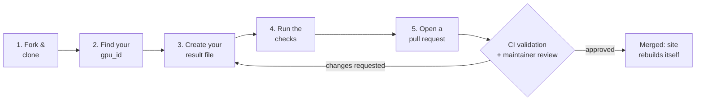

# Contributing to Open GPU Benchmarks

Thanks for helping build an open, reviewable GPU comparison. Every number on the
dashboard comes from a small YAML file in this repository, so **adding a
benchmark result is just adding one file in a pull request.**

## What do you want to do?

| I want to...                              | Go to                                                  |
| ----------------------------------------- | ------------------------------------------------------ |
| **Add my FPS results** (most people)      | [Submit a result in 5 steps](#submit-a-result-in-5-steps) |
| Fix or remove a result I submitted        | [Fixing or removing a result](#fixing-or-removing-a-result) |
| Add a GPU that isn't in the catalog       | [Other contributions](#other-contributions)            |
| Change the dashboard, scripts, or docs    | [Other contributions](#other-contributions)            |

## Submit a result in 5 steps



You need Git, Python 3.10+, and a GitHub account. No other tooling.

### Step 1: Fork and clone

Fork the repository on GitHub, clone your fork, and create a branch:

```powershell
git clone https://github.com/<your-github-username>/open-gpu-benchmarks.git
cd open-gpu-benchmarks
git checkout -b add-rtx-4070-super-cyberpunk
python -m pip install pyyaml numpy
```

### Step 2: Find your `gpu_id`

Open [data/gpus.yaml](data/gpus.yaml) and copy the `id` of your GPU. This is the
only ID the validator accepts.

```yaml
- id: rtx_4070_super          # <- this is your gpu_id
  name: GeForce RTX 4070 Super
  form_factor: desktop
```

Current IDs: `rtx_4090`, `rtx_4080_super`, `rtx_4070_super`, `rx_7900_xtx`,
`arc_a770`, `rtx_4090_laptop`, `rtx_4070_laptop`, `arc_a770m`,
`rog_ally_z1_extreme`, `steam_deck_oled`, `legion_go`.

Your GPU isn't listed? See [Other contributions](#other-contributions).

### Step 3: Create your result file

Create **one file per game run** in your GPU's folder:

```text
data/
└── community/
    └── rtx_4070_super/                      <- folder name = gpu_id
        ├── result_20261003_cyberpunk_mattystacks.yaml   <- your file
        └── raw/
            └── cyberpunk_1440p.csv          <- optional capture (recommended)
```

The file name has four parts:

```text
result_20261003_cyberpunk_2_mattystacks.yaml
       └──┬───┘ └───┬────┘ ┬ └────┬─────┘
       date run   game   repeat  your GitHub username
       (YYYYMMDD) (no     (only   (lowercase is fine;
                  spaces) if you  must match
                          already submitted_by)
                          have a
                          file for
                          that day
                          and game)
```

Pick **one** way to create the file:

**Option A: copy the template (works for any capture method)**

```powershell
Copy-Item templates/community_submission.yaml `
  data/community/rtx_4070_super/result_20261003_cyberpunk_yourname.yaml
```

Then edit the values. The examples below show what to fill in.

**Option B: generate it from a PresentMon or MangoHud CSV**

```powershell
python scripts/parse.py capture.csv `
  --gpu-id rtx_4070_super `
  --game "Cyberpunk 2077" `
  --submitted-by yourname `
  --resolution 1440p `
  --graphics-preset Ultra
```

This writes the correctly named file for you. It does not know your hardware, so
open it afterwards and add the `system:` details (CPU, memory, driver, OS) and
any extra resolution/preset profiles by hand. Copy your CSV into the GPU's
`raw/` folder and point `proof.raw_log` at it (for example
`raw/cyberpunk_1440p.csv`).

### Step 4: Run the checks

```powershell
python scripts/build.py
python scripts/validate.py
python scripts/test_build.py
```

`validate.py` prints `::error::` lines for anything that blocks your PR and
`::warning::` lines for things worth improving. Fix every error. See
[Common mistakes](#common-mistakes) if one isn't obvious.

### Step 5: Open a pull request

```powershell
git add data/community/rtx_4070_super
git commit -m "Add RTX 4070 Super Cyberpunk 2077 results"
git push -u origin add-rtx-4070-super-cyberpunk
```

Open the pull request on GitHub and include:

- [ ] GPU, game, and game version
- [ ] Resolution and graphics preset(s) you ran
- [ ] Anything unusual (overclock, undervolt, power limit, mods)
- [ ] How you captured the numbers (PresentMon, MangoHud, in-game benchmark)

CI runs the same validator you just ran. A maintainer then reviews the evidence.
After merge, the site rebuilds automatically. You do not need to touch
`site/api/` (it is generated).

## Examples

### Minimal file (only what's required)

This is the smallest file that passes validation. It warns about the missing
driver and proof, so prefer the fuller examples below.

```yaml
gpu_id: rtx_4070_super           # must equal the folder name
submitted_by: mattystacks        # your GitHub username
game: Cyberpunk 2077
frame_generation: false          # must be false for comparable runs
result:
  - resolution: 1440p
    graphics_preset: Ultra
    avg_fps: 98.4
    p1_low: 77.1                 # 1% low; can't be higher than avg_fps
```

### Desktop with raw capture (recommended)

One run, two profiles. Each profile starts with its own `-`.

```yaml
gpu_id: rtx_4070_super
submitted_by: mattystacks
benchmark_type: game
game: Cyberpunk 2077
version: "2.12"
frame_generation: false
form_factor: desktop
device_name: ASUS TUF RTX 4070 Super
overclocked: false
result:
  - resolution: 1440p            # first profile
    graphics_preset: Ultra RT
    upscaling: DLSS Quality
    avg_fps: 79.1
    p1_low: 65.0
    p5_low: 68.2                 # optional, from PresentMon
  - resolution: 1080p            # second profile: new dash, same indent
    graphics_preset: Ultra RT
    upscaling: DLSS Quality
    avg_fps: 103.4
    p1_low: 84.7
system:
  cpu: AMD Ryzen 7 7800X3D
  memory: 32 GB DDR5
  power_mode: Performance
  display_mode: direct
  driver: "561.09"
  os: Windows 11
proof:
  raw_log: raw/Cyberpunk_4070S_1440p.csv   # relative to this GPU's folder
  format: presentmon_summary
```

### Laptop (power matters)

Laptop results are grouped by GPU power, so always include `gpu_power_w`.
Validation only warns if it's missing, but your result can't be compared
properly without it.

```yaml
gpu_id: rtx_4070_laptop
submitted_by: mattystacks
game: Baldur's Gate 3
version: "4.1.1"
frame_generation: false
form_factor: laptop
device_name: Lenovo Legion Pro 5
gpu_power_w: 115                 # the TGP your laptop actually runs at
overclocked: false
result:
  - resolution: 1080p
    graphics_preset: Ultra
    avg_fps: 88.0
    p1_low: 61.5
system:
  cpu: Intel Core i7-13700HX
  memory: 16 GB DDR5
  power_mode: Performance
  display_mode: dGPU only        # MUX switch state
  driver: "560.94"
  os: Windows 11
proof:
  raw_log: raw/bg3_1080p.csv
  format: presentmon_summary
```

### Handheld, summary only (no raw capture)

No CSV? Say where the numbers came from with `proof.summary_source`. The
dashboard labels these as summary-only.

```yaml
gpu_id: steam_deck_oled
submitted_by: mattystacks
game: Cyberpunk 2077
version: "2.12"
frame_generation: false
form_factor: handheld
result:
  - resolution: 800p
    graphics_preset: Low
    avg_fps: 41.0
    p1_low: 33.0
system:
  power_mode: 15W
  os: SteamOS 3.6
proof:
  summary_source: Steam Deck performance overlay, 3-minute run in the market area
```

## What's required

| Field                                          | Required? | Notes                                                   |
| ---------------------------------------------- | --------- | ------------------------------------------------------- |
| `gpu_id`                                       | **Yes**   | Must match the folder name and an ID in `gpus.yaml`     |
| `submitted_by`                                 | **Yes**   | Your GitHub username; file name must end with it        |
| `game`                                         | **Yes**   | Free text, keep spelling consistent for grouping        |
| `result` list                                  | **Yes**   | At least one entry; every entry starts with `-`         |
| `result[].resolution`, `graphics_preset`       | **Yes**   | Use `graphics_preset`, never `settings`                 |
| `result[].avg_fps`, `p1_low`                   | **Yes**   | `p1_low` must be less than or equal to `avg_fps`        |
| `frame_generation`                             | Must be `false` | Frame generation runs aren't comparable            |
| `gpu_power_w` (laptops)                        | Warning   | Strongly encouraged                                     |
| `proof.raw_log` or `proof.summary_source`      | Warning   | Raw capture preferred                                   |
| `system` (CPU, memory, driver, OS, power mode) | Optional  | Encouraged: reviewers and readers use it                |

## Common mistakes

| Mistake | What you'll see | Fix |
| ------- | --------------- | --- |
| Folder doesn't match `gpu_id` | `gpu_id '...' must match GPU folder '...'` | Move the file, or correct `gpu_id` |
| Made-up GPU ID | `unknown gpu_id` | Copy the ID from `data/gpus.yaml` |
| File name doesn't end with your username | `file name '...' must follow result_YYYYMMDD_<game>_<user>.yaml` | Rename the file; keep `submitted_by` identical |
| Forgot the `-` or repeated `result:` | `result[0] missing ...` or lost entries | One `result:` key, one `-` per profile |
| Used `settings:` | `missing graphics_preset` | Rename to `graphics_preset` |
| Ran with DLSS/FSR/Frame Gen | `frame generation must be disabled...` | Re-run with frame generation off (upscaling is fine, record it in `upscaling`) |
| `p1_low` bigger than `avg_fps` | `p1_low ... is impossible` | Check you didn't swap the values |
| Far from the official result | `differs N% from matching official baseline` | Re-check the settings, or explain the difference in the PR |

## How your numbers appear on the dashboard

```text
 your file ─┐
            ├─►  same GPU + game + resolution + preset  ─►  ONE row (averaged)
 other file ┘    (and same laptop power, if a laptop)

 1440p Ultra RT  ─►  its own row         Desktop and laptop
 1080p Ultra RT  ─►  a different row     versions of a GPU are
                                         never combined.
```

Exact machine details stay on each run; the charts show the grouped summary.

## Raw evidence

Raw captures make a result reviewable, so please include one when you can. Put
them inside the same GPU folder and reference them relative to it:

```text
data/community/rtx_4070_super/raw/Cyberpunk_4070S_1440p.csv
                              └── proof.raw_log: raw/Cyberpunk_4070S_1440p.csv
```

Raw files stay in Git but are not published in the site's JSON.

## Fixing or removing a result

Open a pull request that edits or deletes your result file. If the file had a
raw capture, keep it, or say in the PR why it's being removed.

## Other contributions

<details>
<summary><strong>Official results, new GPUs, code, and docs</strong></summary>

**Official results** use `templates/official_result.yaml` and live at
`data/official/<gpu_id>/result_YYYYMMDD_<benchmark>.yaml`. They don't need
`submitted_by`. Community results are compared against them.

**New GPU:** add an entry to [data/gpus.yaml](data/gpus.yaml) following the
nested spec sections of the existing entries (`identity`, `classification`,
`silicon`, `memory`, `clocks`, `power`, `release`, `features`). Fill every
required leaf (name, codename, vendor, form factor, architecture, memory
capacity/type/bus/bandwidth, boost clock, TDP), quote every date so YAML
keeps it a string, and run `python scripts/build.py` to validate the specs
before opening the PR.

**Code, dashboard, or workflow changes:** add a line under `Unreleased` in
[CHANGELOG.md](CHANGELOG.md). Data-only submissions can skip it. Before opening
the PR, run:

```powershell
python scripts/build.py
python scripts/validate.py
python scripts/test_build.py
python -m py_compile scripts\build.py scripts\validate.py scripts\parse.py
git diff --check
```

If you changed a rule, update every document that states it:
`CONTRIBUTING.md`, `docs/COMMUNITY_SUBMISSIONS.md`, `data/community/README.md`,
and `.github/copilot-instructions.md`.

Do not commit the generated `site/api/` files; the Pages workflow rebuilds them.

**Benchmark types:** `benchmark_type` other than `game` is kept in the GPU API
but isn't shown in the game-FPS dashboard yet.

</details>

<details>
<summary><strong>Preview the dashboard locally</strong></summary>

```powershell
python scripts/build.py
python -m http.server 8000 --directory site
```

Open <http://localhost:8000/>.

</details>

For the full review and grouping rules, see
[docs/COMMUNITY_SUBMISSIONS.md](docs/COMMUNITY_SUBMISSIONS.md).
